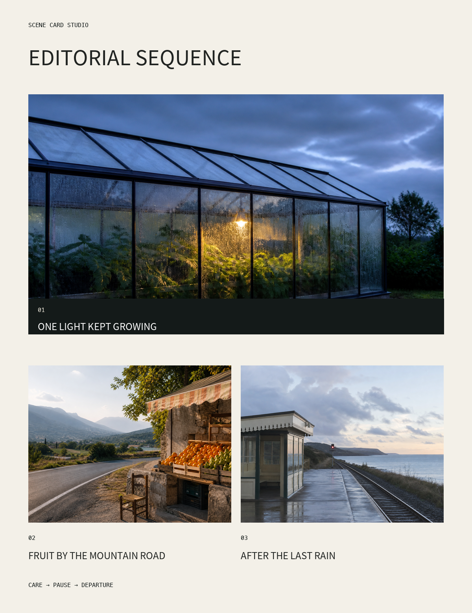
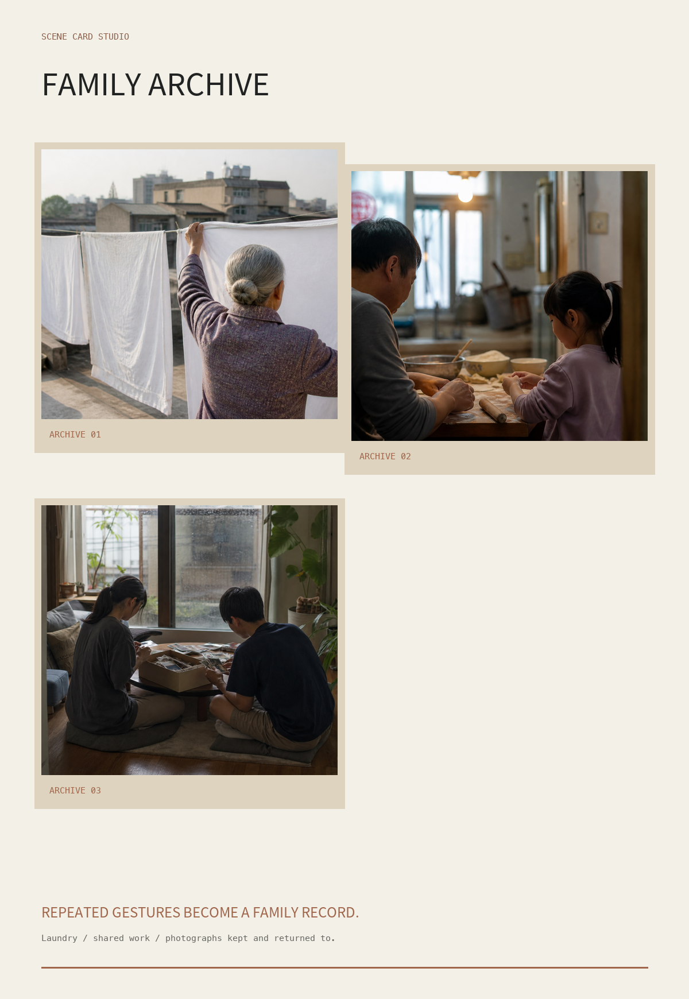
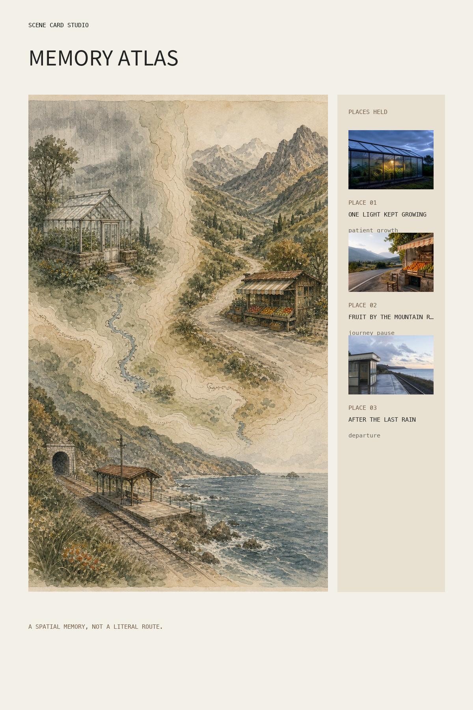
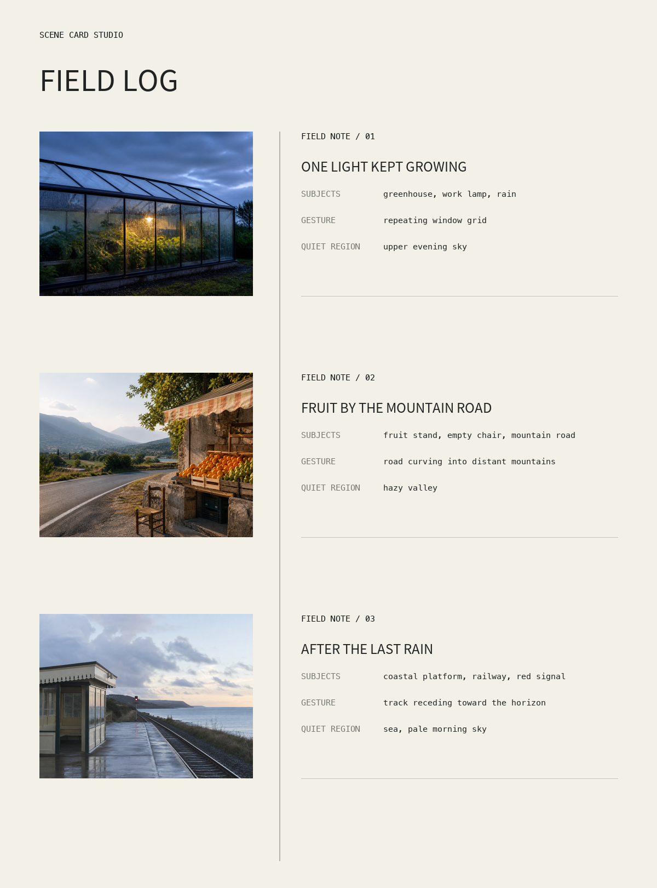

# Scene Card Studio｜场景卡片工作室

中文 · [English](README.md)

> **这不是一个照片风格转换工具，而是一套基于 Scene Card 的个人照片视觉叙事引擎。**

Scene Card Studio 将照片中可观察的事实转化为可编辑的叙事决策和确定性版面。它不只问“照片应该变成什么风格”，而是先判断“这段故事应该如何被阅读”。

```text
照片 → 观察事实 → 理解判断 → 视觉导演 → 叙事排序 → Narrative System → 可编辑输出
```

## Before / After 首页案例

以下原始照片均为本项目专门生成的原创示例。Before 展示未经叙事处理的输入照片组；After 使用同一组 Scene Cards，通过不同记录机制输出。

| Before：原始照片组 | After：视觉导演结果 |
| --- | --- |
|  |  |

[查看本案例的三层 Scene Cards](examples/generated-story.json)

### 案例 2 · Family Archive｜家庭档案

| Before：虚构人物纪实输入 | After：家庭记录 |
| --- | --- |
|  |  |

第二组案例把晾衣、包饺子、整理旧照片这些重复动作，读成一段跨代传递的照料记录。

[查看 Family Archive Scene Cards](examples/cases/family-archive/story.json)

这里发生的不是风格滤镜转换。系统先区分观察事实与解释，再分配故事角色、生成可编辑导演备注、推荐 Narrative System，最后进行确定性渲染。

### Editorial Sequence｜编辑序列


让照片保持主体地位，通过留白、顺序和角色标签建立可阅读的摄影叙事。

### Memory Atlas｜记忆地图



适合旅程、离开、距离、返回与空间记忆。

### Field Log｜现场日志



适合人物纪实、旅行观察、现场证据和克制的注释系统。

[查看原创样片](examples/photos) · [查看 Scene Cards](examples/generated-story.json) · [查看设计原则](DESIGN_PRINCIPLES.md)

## AI 视觉导演层

Scene Card 将信息明确分成三层：

- **Observation / 观察层**：记录照片中实际可见的主体、方向、色彩和安静区域。
- **Interpretation / 理解层**：记录暂定主题、情绪和置信度。
- **Direction / 导演层**：记录可编辑的故事角色、导演备注和版面重点。

这种拆分避免把 AI 的推测伪装成照片事实，也允许用户覆盖任何导演判断。首页高级叙事字段明确标记为人工导演示例；当前 analyzer 只提供低置信度启发式判断。

## 不是风格菜单

项目通过“记录方式 / 表达机制”扩展，而不是堆叠复古、电影感、水彩等效果。适合扩展的方向包括：

- `family-archive`：家庭时间档案；
- `contact-sheet`：摄影选片与淘汰逻辑；
- `journey-sequence`：旅程与空间推进；
- `memory-atlas`：地点、物件和记忆连接；
- `field-log`：现场观察记录；
- `exhibition-label`：策展顺序和作品说明。

每个 Narrative System 都必须说明它承担了什么叙事工作，只有视觉关键词不算一个系统。

## 快速开始

需要 Python 3.10 及以上。自动分析和 PNG 输出需要 Pillow。

```bash
python -m pip install -e '.[images]'
scene-card-studio analyze photos/*.jpg --output story.json
scene-card-studio recommend story.json
scene-card-studio render story.json --style editorial-sequence --format png --output story.png
scene-card-studio render story.json --style field-log --mode workprint --format png --output notes.png
```

默认使用 `presentation`，隐藏内部导演术语；需要查看观察、理解、角色和导演备注时使用 `--mode workprint`。输出高度会随照片数量动态增长，照片路径以 Scene Card JSON 所在目录为基准解析。

## Codex Skill

将 `skills/scene-card-studio` 复制到 Codex Skills 目录并重启，然后输入：

```text
使用 $scene-card-studio 把这些照片编排成一组安静的家庭视觉档案。
```

## 原创与隐私

- 不捆绑第三方风格参考资产；
- 不复制其他同类仓库的提示词；
- 示例图片均为项目新生成的原创演示素材；
- 核心创新是 Scene Card、Visual Director 与叙事渲染工作流；
- 除非用户明确选择，否则原始照片只在本地处理。

完整说明见 [DESIGN_PRINCIPLES.md](DESIGN_PRINCIPLES.md)。

## 路线图

- 可由用户修改的视觉导演判断；
- `contact-sheet`、`journey-sequence`；
- 主体感知裁切；
- 可打印 PDF 与社交媒体卡片；
- 浏览器预览和拖拽排序；
- 社区 Narrative System 插件。

## 许可证

Apache-2.0。贡献的示例素材必须提供清晰的来源和使用条款。
