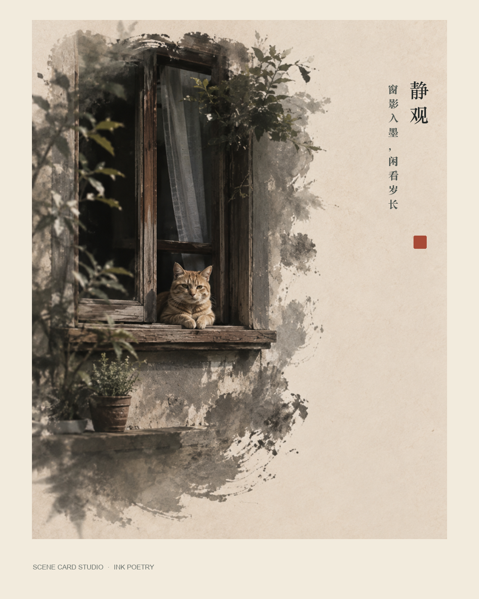

# Scene Card Studio Visual Selection Guide

[中文](VISUAL-GUIDE.zh-CN.md) · [Back to README](README.md)

Scene Card Studio does not randomly apply one of 24 effects. Two composable decisions control the result:

```text
photo evidence + narrative goal → Narrative System (how the photo is read)
aesthetic + material request    → Expression Profile (how it is rendered)
```

The same lakeside photograph could use `travel-journal` + `travel-zine` for a restrained journey page, or `memory-atlas` + `selective-material-relief` to keep a real boat photographic while rebuilding the mountains as relief.

## Automatic or explicit selection

Upload a photograph to Codex and ask:

> Use $scene-card-studio to inspect this photograph and automatically choose the strongest Narrative System and compatible Expression Profile. Explain the choice in one sentence; show two candidates only if the route is close. Preserve subject identity and recognizable source geography.

Automatic selection is conservative:

- Codex first observes subjects, space, gesture, light, and tone and completes the Scene Card.
- The Narrative System is ranked from visible evidence and the user's brief.
- Codex selects a non-default Profile only when the user names a language such as watercolor, Guofeng ink, 3D miniature, pixel, or cyanotype, or explicitly delegates the visual choice.
- With no explicit treatment, `source-led` derives direction from the photograph itself.
- Low-confidence or near-tied routes are shown to the user instead of being silently forced.
- Remote generation still requires provider-, purpose-, and file-specific upload consent.

Local preparation:

```bash
scene-card-studio direct photo.jpg \
  --brief "automatically choose the strongest narrative and visual expression" \
  --output-dir scene-card-output
```

`direct` prepares Scene Cards, a Prompt Manifest, and a Workprint locally; it does not call an image-generation provider by itself. The bare CLI can route a Profile only from explicit visual terms in the brief. When visual choice is delegated, Codex inspects the photograph first and passes the selected Profile explicitly to `direct`. The installed Skill performs the finished After workflow after semantic direction is complete and upload consent is recorded.

To choose explicitly:

> Use $scene-card-studio with Memory Atlas and chinese-ink-poetry. Keep the real subject and setting recognizable; dissolve only source-derived edges into ink. Text: STILLNESS｜Window shadows enter ink; the afternoon grows quiet.

```bash
scene-card-studio direct photo.jpg \
  --system memory-atlas \
  --expression-profile chinese-ink-poetry \
  --brief "retain the real subject; source-derived edges dissolve into ink" \
  --output-dir scene-card-output
```

## Step 1 — Narrative Systems

A Narrative System determines how the photograph is read; it is not a filter. One source always produces one standalone After. “Multi-photo behavior” describes only what happens when several related sources are supplied.

| System | Choose it when | Multi-photo behavior | Example |
| --- | --- | --- | --- |
| `cinematic-storyboard` · Cinematic Sequence | time, action, weather, motivated light, or shot relationships matter | separate frames with continuity |  |
| `memory-atlas` · Memory Atlas | place, distance, direction, route, or spatial memory matters | one spatial synthesis |  |
| `family-archive` · Family Chronicle | supplied people, objects, domestic gestures, or time recur | one archival synthesis |  |
| `minimal-editorial` · Quiet Editorial | one subject, negative space, geometry, light, and material dominate | separate images |  |
| `editorial-sequence` · Editorial Rhythm | scale, density, contrast, and pause should carry the sequence | separate directed frames |  |
| `field-log` · Field Log | observation, tools, specimens, process, or documentary detail matters | separate records |  |
| `museum-catalogue` · Museum Catalogue | a supplied object or craft detail should be inspected closely | separate catalogue plates |  |
| `travel-journal` · Travel Journal | movement, thresholds, pauses, tickets, or supplied place data matter | one journey synthesis |  |
| `journey-taxonomy` · Journey Taxonomy | visible terrain, weather, life, objects, materials, and movement should be classified | one place taxonomy |  |
| `street-reportage` · Street Reportage | public gestures, event context, and documentary fact matter | separate frames in factual order |  |
| `fashion-editorial` · Fashion Editorial | pose, garment construction, fabric, crop, and shot scale matter | separate fashion frames |  |

## Step 2 — Expression Profiles

All 24 Profiles below—default `source-led` plus 23 non-default Profiles—have a repository example. Use the phrase as part of the brief, and run `scene-card-studio profiles --system SYSTEM_ID` to check compatibility.

### Photographic, cinematic, and editorial

| Profile | Result | Brief phrase | Example |
| --- | --- | --- | --- |
| `source-led` | direction derived from source light, color, space, and surface | “keep it source-led; improve narrative, hierarchy, and light” |  |
| `rain-nocturne` | motivated rain-night cinema without neon excess | “a restrained rain nocturne using the real practical lights” |  |
| `quiet-window-light` | warm window light, geometric shadow, low density, fine grain | “quiet window-light editorial; make light the second subject” |  |
| `heritage-portrait` | restrained silver-gelatin tonality and hand coloring | “a restrained hand-colored heritage portrait” |  |
| `monochrome-reportage` | detailed black-and-white reportage with silver-rich grain | “black-and-white street reportage with preserved context” |  |
| `autochrome-memory` | restrained early-color photographic material without period fiction | “early-color plate material without inventing a historical identity” |  |
| `chinese-photo-editorial` | contemporary ink-and-paper editorial with a real photo anchor | “restrained Chinese photo editorial using only source-supported motifs” |  |

### Paint, print, and paper media

| Profile | Result | Brief phrase | Example |
| --- | --- | --- | --- |
| `watercolor-contour` | real photographic anchors inside watercolor terrain and pencil contours | “retain the real building inside watercolor terrain and pencil contours” |  |
| `watercolor-chronicle` | people, objects, and places fully repainted in one watercolor medium | “repaint the entire image in watercolor, including every person” |  |
| `graphite-paper` | documentary photography, graphite studies, tracing paper, and fibers | “organize this family record with graphite and tracing paper” |  |
| `mineral-ink-memory` | mineral pigment and ink organize spatial depth and memory | “a mineral-pigment and ink memory field” |  |
| `impasto-light-study` | thick physical paint follows one source-supported light path | “an impasto light study whose strokes follow the source light” |  |
| `gouache-place-study` | opaque matte shape groups preserve recognizable place structure | “a restrained opaque gouache place study” |  |
| `risograph-route` | limited inks, halftone, and overprint express a supplied route | “a two- or three-ink risograph journey route” |  |
| `cyanotype-archive` | evidence-bound Prussian-blue contact-print language | “an evidence-bound cyanotype archive of the visible objects” |  |
| `chinese-ink-poetry` | recognizable real subject and setting, source-derived ink edges, exact supplied verse | “Guofeng ink poetry; Text: STILLNESS｜Window shadows enter ink” |  |

### Relief, textile, and physical material

| Profile | Result | Brief phrase | Example |
| --- | --- | --- | --- |
| `paper-relief-landscape` | the complete place becomes one continuous layered-paper relief | “rebuild the full landscape as coherent layered-paper relief” |  |
| `sculpted-place-diorama` | real volume, physical lighting, and geographic depth in a 3D miniature | “rebuild this place as a physical 3D miniature terrain model” |  |
| `threaded-landscape` | the full image becomes one woven, embroidered, felted textile relief | “repaint the complete landscape as continuous threaded textile relief” |  |
| `selective-material-relief` | the real subject stays photographic while only the environment becomes relief | “keep the boat photographic; transform only the mountains into shallow relief” |  |

### Graphic, journey, and experimental

| Profile | Result | Brief phrase | Example |
| --- | --- | --- | --- |
| `pixel-diary` | the complete scene is rebuilt on one consistent pixel grid | “rebuild the whole scene as a consistent pixel diary” |  |
| `pixel-ink-memory` · experimental | crisp pixel near-field and ink-wash distance share one composition | “pixel-and-ink memory: pixel foreground, ink distance, never split screen” |  |
| `dream-logic` | one legible impossible spatial rule with identity preserved | “preserve identity and build one readable impossible spatial rule” |  |
| `travel-zine` | one dominant image, sparse source-derived details, route evidence, and whitespace | “a sparse travel zine centered on one memory node” |  |

## Fast choices by photograph

| Your source | Recommended combination | Why |
| --- | --- | --- |
| one travel landscape | `travel-journal` + `travel-zine` | a clear, restrained, shareable journey page |
| several travel photographs | `journey-taxonomy` + `travel-zine` | organizes place evidence while keeping one coherent language |
| a boat, bicycle, lighthouse, or other clear subject in a landscape | `memory-atlas` + `selective-material-relief` | the subject stays real while the environment gains visible depth |
| a pet, person, or building that should become Guofeng | `minimal-editorial` or `memory-atlas` + `chinese-ink-poetry` | preserves the photograph, uses ink for transition, and adds exact text afterward |
| an ordinary portrait | `family-archive` + `heritage-portrait` | restrained photographic material without invented period identity |
| a still life, room, or window-side subject | `minimal-editorial` + `quiet-window-light` | hierarchy, tactile detail, and light produce quiet refinement |
| street or rainy night photography | `street-reportage` + `monochrome-reportage`, or `cinematic-storyboard` + `rain-nocturne` | factual observation versus cinematic sequence |
| mountain, water, or grassland landscape | `travel-journal` + `threaded-landscape` / `paper-relief-landscape` / `sculpted-place-diorama` | textile, paper, or physical 3D interpretations |
| uncertain; stay close to the source | automatic System + `source-led` | avoids forcing a material treatment |

## Three distinctions that matter

1. `watercolor-contour` keeps photographic anchors; `watercolor-chronicle` repaints the complete image.
2. `paper-relief-landscape` transforms the complete place; `selective-material-relief` keeps the real photographic subject and changes only the authorized environment.
3. `chinese-photo-editorial` does not require verse; `chinese-ink-poetry` is designed for Guofeng photo treatment plus deterministic typography.

Examples demonstrate the intended visual mechanism, not a pixel-identical template. Subject identity, place, light, and spatial relationships come from the uploaded photograph; the Profile constrains the visual language.
